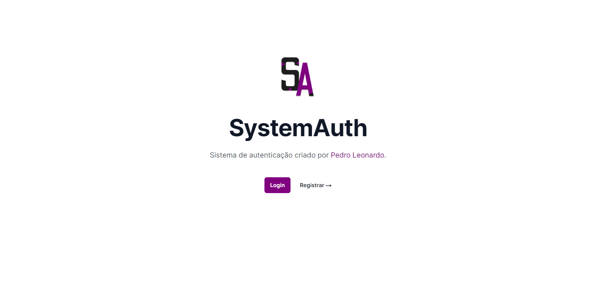
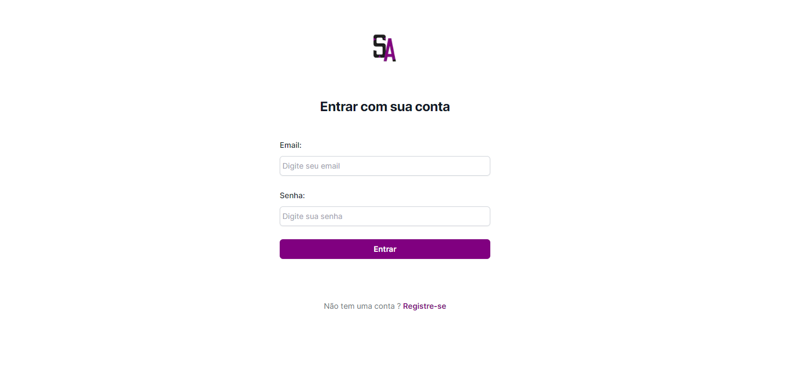
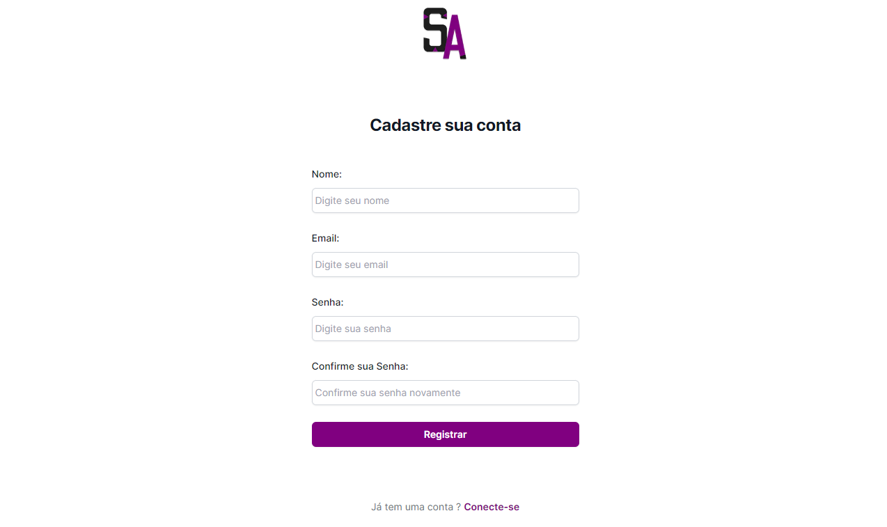

<h1 align="center": center">SytemAuth</h1>

<h2>💡The idea of creating was:</h2>
<ul>
  <li>Presenting my knowledge.</li>
  <li>Helping those in need of assistance.</li>
</ul>
<h2>⚙️Used Technologies:</h2>
<ul>
  <li>Next.Js</li>
  <li>TypeScript</li>
  <li>React.JS</li>
  <li>Node.Js</li>
  <li>Express</li>
  <li>MongoDB</li>
</ul>
